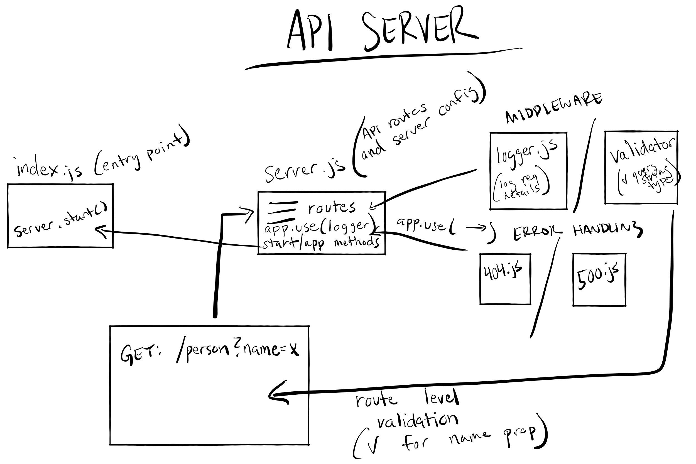

# 401 LAB - 02

## Project: Basic Express Server

### Author: Clement Buchanan

### Contributor: Jenner Dulce

### Links and Resources

- [ci/cd](https://github.com/ClementBuchanan/basic-express-server/actions) (GitHub Actions)

- [front-end application](https://basic-express-svr.herokuapp.com/) (Heroku Deployment)

### Setup and Structure

├── .gitignore
├── .env
|---assets
|---coverage
|---node-modules
├── __tests__
│   ├── server.test.js
│   ├── validator.test.js
│   ├── logger.test.js
├── src
│   ├── error-handlers
│   │   ├── 404.js
│   │   ├── 500.js
│   ├── middleware
│   │   ├── logger.js
│   │   ├── validator.js
│   ├── server.js
├── index.js
|---License
|--- Package-lock.json
└── package.json

#### `.env` requirements

- `PORT` - 3333

#### How to initialize/run your application (where applicable)

- `npm index.js`

#### How to use your library (where applicable)

#### Tests

- How do you run tests? - run `npm test` from the terminal
- All tests ran and passed successfully
  - `404 on a bad method`
  - `500 if no name in the string query`
  - `200 if the name is in query string`
  - `given a name in the query string`

#### UML

### Pull Requests

- [PR 1 - Completed Lab-02](https://github.com/ClementBuchanan/basic-express-server/pull/1)
- [PR 2 - Updated Package.json](https://github.com/ClementBuchanan/basic-express-server/pull/2)
- [PR 3 - Completed readme.md](https://github.com/ClementBuchanan/basic-express-server/pull/3)
- [PR 4 - Updated and completed readme.md](https://github.com/ClementBuchanan/basic-express-server/pull/4)
- [PR 5 - Updated readme.md with setup structure](https://github.com/ClementBuchanan/basic-express-server/pull/5)